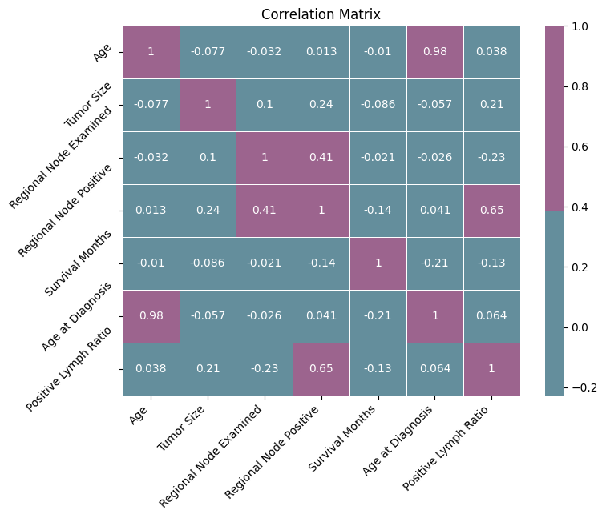

# Breast Cancer Survival Classification
Project of Machine Learning (ML) Course for the `Master in Data Science` Program of Universitat Politècnica de Catalunya (UPC)
***
## Instructions for Executing Analysis Notebooks

* Include in a single folder the files [01.EDA-feature-extraction.ipynb](./notebooks/01.EDA-feature-extraction.ipynb), [02.Modeling.ipynb](./notebooks/02.Modeling.ipynb) and [Breast_Cancer.csv](./notebooks/Breast_Cancer.csv) included in the repository.
* Execute the notebooks with the following order:
	* [01.EDA-feature-extraction.ipynb](./notebooks/01.EDA-feature-extraction.ipynb)
		* This notebook generates in the end the updated dataset, which includes all the changes introduced during the EDA.
		* The name of the updated dataset is set to be [Breast_Cancer.csv](./notebooks/Breast_Cancer.csv). This file is being used from the second notebook in order to complete the modeling part.
	* [02.Modeling.ipynb](./notebooks/02.Modeling.ipynb)
* Both notebooks generate some extra csv files, containing information used during the analysis
	* E.g.: [chi-2.csv](./results/chi-2.csv) and [chi-2-2.csv](./results/chi-2-2.csv) files mentioned in the report are generated during the execution of the above-mentioned notebooks. They can also be found in this repository.
* Uncomment the first cell of the notebooks in order to install missing libraries.
* Click on the `Run all` button of the notebooks to reproduce the results of the whole project.

## Analysis Includes
1. Exploratory Data Analysis (EDA)
    * Univariate Exploratory Analysis
    * Univariate Outliers Analysis
    * Bivariate Exploratory Analysis
    * Multivariate Outlier Analysis
    * Feature Selection/Extraction
2. Modeling
    * Dataset Splits
    * Preprocessing
    * Learning Algorithms
    * Model Comparison & Hyper Parameter Tuning
    	* 5-fold Cross Validation on the following models, with multiple hyper-parameter values:
     		* Logistic Regression
       		* Random Forest
       		* SVM
       		* Gradient Boosting
       		* kNN
       		* Decision Tree
       		* Naive Bayes
    * Final Model Performance Analysis (Generalization, bias, variance analysis)
        * Training-Test Error Analysis on the max_depth Parameter
        * Training-Test Error Analysis on the n_estimators Parameter
        * Training-Test Error Analysis on the Training Data Size
        * Final Performance Metrics
        * Interpretability of the Final Model
3. Limitations & Future Work

## Executed Notebooks
The following two `html` files, present the notebooks of the project executed.
* `EDA-feature-extraction.html`
* `Modeling.html`

## Brief Analysis Results

- `Final Univariate Analysis`:

    
    

- `Final Bivariate Analysis`:

    
    
    

- `Best Hyperparameters for Each Model`:

    | Model               | Best Hyperparameters                                              | Accuracy  | Precision | Recall   | F1-score | Validation Errors |
    |---------------------|-------------------------------------------------------------------|-----------|-----------|----------|----------|-------------------|
    | Logistic Regression | {'C': 1, 'class_weight': None, 'penalty': 'l1'}                  | 0.797103  | 0.792764  | 0.804576 | 0.79855  | 0.010134          |
    | Random Forest       | {'class_weight': 'balanced', 'max_depth': 10, 'n_estimators': 100}| 0.915019  | 0.909497  | 0.921833 | **0.915568**| 0.011617          |
    | SVM                 | {'C': 10, 'class_weight': 'balanced', 'kernel': 'rbf'}            | 0.855073  | 0.864324  | 0.842774 | 0.853282| 0.006828          |
    | Gradient Boosting   | {'learning_rate': 0.1, 'n_estimators': 300}                       | 0.901186  | 0.913674  | 0.886262 | 0.899721| 0.013388          |
    | KNN                 | {'n_neighbors': 3, 'weights': 'distance'}                         | 0.901844  | 0.998383  | 0.805011 | 0.891281| 0.005844          |
    | Decision Tree       | {'class_weight': None, 'max_depth': 10, 'min_samples_split': 2}   | 0.877250  | 0.897860  | 0.852016 | 0.873843| 0.013492          |
    | Naive Bayes         | {}                                                                | 0.684454  | 0.639645  | 0.845414 | 0.728181| 0.006060          |

- `Final Model Performance Metrics`:

    **Random Forest Classifier - Test Results** :
    Accuracy: 0.8809
    Precision: 0.9361
    Recall: 0.9228
    F1-score: 0.9294
    

- `Bias & Variace Analysis`:
    
    
    

- `Feature Importance`:

    